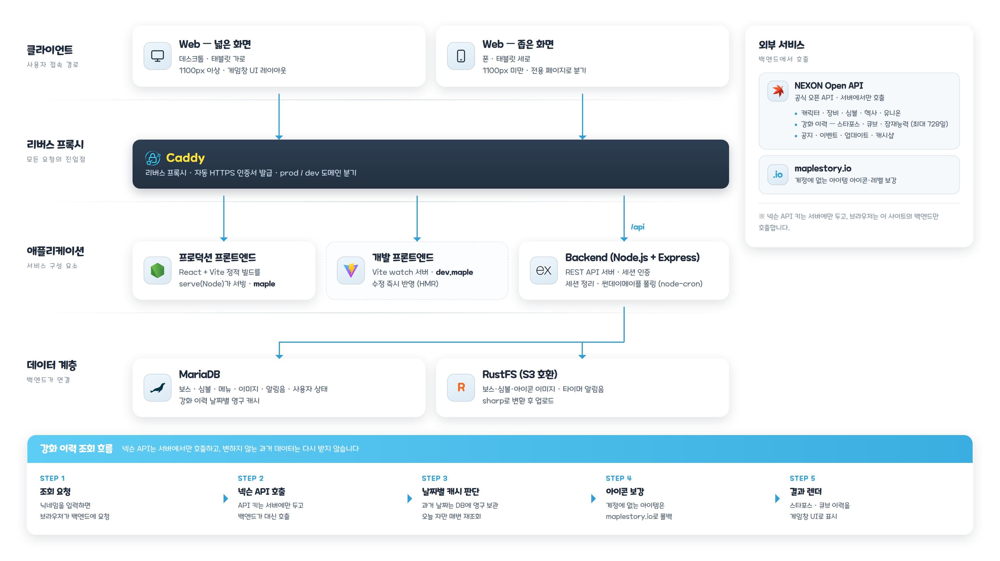

# 🍄 메이플스토리 유틸리티

메이플스토리 플레이에 필요한 계산기 모음입니다. NEXON Open API로 캐릭터 정보를 불러와 보스 수익·심볼·헥사·해방을 계산하고, 화면 인식으로 동작하는 재획 타이머까지 제공하는 풀스택 서비스입니다.


---

## ✨ 주요 기능

- 💎 **주간 보스 수익 계산기** — 보스·난이도·파티원별 결정석 수익 정산. 캐릭터 12개/계정 한도와 시즌 보스(챌린저스) 예외까지 반영
- 🔮 **심볼 계산기** — 아케인·어센틱·그랜드 어센틱 심볼의 남은 심볼 수·메소·완료 예상일. 장착 심볼과 일퀘 보너스(이벤트 스킬·에테리온 아티팩트)를 API에서 자동 반영
- ⬡ **헥사 강화 계산기** — 6차 코어별 솔 에르다·조각 소모량과 진행도, 주간 수급량 기반 완료 시점 산정. 보스 수익을 조각 구매로 환산해 반영
- ⚔️ **해방 날짜 계산기** — 제네시스 무기 해방 8단계(총 6,500) 진행도 추적, 주간 보스 스케줄로 완료 예상 주차 산정 (제네시스 패스 배수 반영)
- 🔨 **장비 강화 기록** — 스타포스·큐브·잠재능력 이력을 아이템 단위로 묶어 사용 메소·성공률·등급업 확률 분석 (전체 기간, 날짜별 영구 캐시)
- ⏱️ **재획 타이머** — 게임 화면을 인식해 **솔 야누스 사이클 · 룬 등장 · VIP 부스터 종료** 세 가지를 각각 알립니다. 새벽(설치기)·황혼(추가타) 모드 자동 판별, PiP 미니바
- 📰 **공지사항 · 썬데이 메이플** — 넥슨 공지/이벤트/업데이트/캐시샵 연동, 주차별 썬데이 메이플 자동 수집(node-cron)
- 🛠️ **관리자** — 보스·심볼·시즌·이미지·메뉴·타이머 알림음 관리 (S3 업로드, sharp 이미지 처리)
- 📱 **PC / 모바일 분기** — 뷰포트 폭(1100px) 기준으로 전용 페이지·레이아웃 자동 분기

---

## 🏗 시스템 구조



| 구성 | 역할 |
| --- | --- |
| **Caddy** | 리버스 프록시 · 자동 HTTPS. prod/dev 도메인을 각 컨테이너로 분기 |
| **프로덕션 / 개발 프론트엔드** | 같은 소스를 정적 빌드(serve) / Vite watch 두 갈래로 서빙 |
| **Backend (Node.js + Express)** | REST API + 세션 인증 + 스케줄러(node-cron)를 한 프로세스에서 운영 |
| **MariaDB** | 보스·심볼·메뉴·이미지·사용자 상태, 강화 이력 날짜별 영구 캐시 (다른 서비스와 공유하는 인스턴스) |
| **RustFS (S3 호환)** | 보스·심볼·아이콘 이미지 원본 저장 (sharp로 변환 후 업로드) |
| **NEXON Open API** | 캐릭터·심볼·헥사·유니온·강화 이력·랭킹·공지 |

> 넥슨 API 키는 서버에만 두고, 브라우저는 이 사이트의 백엔드만 호출합니다.
> 로그인은 사용자가 입력한 넥슨 API 키로 계정을 식별하며 **키 자체는 저장하지 않습니다**.

### 재획 타이머 — 화면 인식 파이프라인

게임 창을 화면 공유로 받아 세 가지를 동시에 지켜봅니다. **브라우저 안에서만 처리하며 화면 영상은 서버로 보내지 않습니다.**

```
              ┌─ 퀵슬롯 야누스 아이콘 ─▶ 쿨타임 숫자 ─▶ 사이클 판정 ─▶ 알림 예약
화면 공유 ────┼─ 상단 "등장" 문구 ────▶ 룬 알림                       (AudioContext)
(getDisplayMedia)  └─ 중앙 상단 "남은시간" ─▶ 남은 초 판독 ─▶ 0초에 알림 예약
```

셋 다 **정규화 상호상관(NCC)** 으로 찾고, 무거운 계산은 워커에서 돌립니다.

- **밝기가 아니라 자주색 성분 `(R+B)/2 − G`로 찾습니다.** 퀵슬롯 아이콘 위에는 단축키 글자가 흰색·노란색으로 얹혀 밝기 분포를 망가뜨립니다 — 실측하면 밝기로는 0.16~0.33(잡음 수준), 색 성분으로는 0.65~0.78이 나옵니다
- **쿨타임 숫자가 바뀌는 순간**은 게임 내부 시계의 정확한 1초 경계라, 몇 번만 읽으면 설치 시각이 확정됩니다. 총 쿨타임 길이는 가정하지 않습니다(쿨감 장비에 따라 달라짐)
- **모드는 자동 판별합니다** — 새벽·황혼 원본을 모두 대조해 이긴 쪽으로 전환합니다
  - **새벽**(설치기): 스킬 레벨로 정해지는 지속시간을 셉니다
  - **황혼**(추가타): 바닥에 떨어진 아이템이 2분이면 사라지므로 그 전에 알리고, 사냥을 재개한 순간부터 다음 사이클을 셉니다
- 알림은 `setTimeout` 대신 **AudioContext 예약** — 백그라운드 탭에서도 밀리지 않습니다
- **룬 등장**은 문구 중 '등장' 두 글자만 봅니다. 해방 후 문구·솔 에르다 안내도 같은 초록 계열이라 색·위치로는 갈라지지 않는데, 이 단어는 등장 문구에만 있습니다. 밝기가 아니라 **초록 우세 성분 `G − (R+B)/2`** 로 봐서 밝은 맵·어두운 맵 모두에서 잡힙니다 (일반룬·축복룬은 글꼴 크기가 달라 템플릿을 따로 둡니다)
- **VIP 부스터**는 "남은시간" 라벨을 찾은 뒤 그 자리에서 **남은 초를 읽어** 0초에 울리도록 미리 예약합니다. 박스가 사라지는 순간만 보면 인벤토리 창이 잠깐 가릴 때 종료로 오인합니다. 게임 창을 통째로 공유하면 제목 표시줄이 섞여 배율이 어긋나므로 **배율은 가정하지 않고 화면에서 가장 잘 맞는 것을 고릅니다**
- 알림음은 서버(RustFS + DB)에서 받아옵니다 — 관리자 화면에서 추가·정렬하며 코드 수정이 필요 없습니다

### 장비 강화 기록 — 이력 캐시

넥슨 이력 API는 **하루치 응답이 변하지 않으므로** 날짜별로 DB에 영구 캐시합니다(`enchant_history_cache`). 최초 1회만 전체 기간을 훑고 이후에는 즉시 로드합니다.

> API 제약: 이력 보존 약 728일, **아이템 개체 식별자 없음**(같은 캐릭터의 동명 장비는 한 항목으로 합산), 파괴 방지 실제 발동 여부 판별 불가.
> 비용은 API가 주지 않아 공개 공식으로 산출하며, **MVP·PC방 할인처럼 시점을 알 수 없는 할인은 제외**합니다.

---

## 📁 프로젝트 구조

```
maplestory-utils/
├── frontend/                 # React 19 + Vite 프론트엔드
│   └── src/
│       ├── features/         # 기능별 모듈 (자동 등록)
│       │   ├── boss-crystal/ # 주간 보스 수익 계산기
│       │   ├── symbol/       # 심볼 계산기
│       │   ├── hexa-matrix/  # 헥사 강화 계산기
│       │   ├── liberation/   # 해방 / 제네시스 진행도
│       │   ├── enchant/      # 장비 강화 기록
│       │   ├── timer/        # 재획 타이머 (화면 인식은 브라우저, 알림음만 서버)
│       │   ├── admin/        # 관리자 화면
│       │   └── registry.js   # PC/모바일 컴포넌트 자동 매핑
│       ├── components/       # common / pc / mobile 공용 컴포넌트
│       ├── pages/            # pc / mobile 페이지
│       ├── routes/           # pc / mobile 라우트
│       ├── hooks/            # 커스텀 훅 (캐릭터 조회·상태 동기화 등)
│       ├── api/              # API 클라이언트
│       ├── stores/           # Zustand 스토어
│       ├── utils/            # 포맷 유틸
│       └── App.jsx           # matchMedia(1100px) PC/모바일 분기
│
├── backend/                  # Node.js(ESM) + Express 5 백엔드
│   ├── routes/               # auth, me, character, boss-crystal, symbol, hexa,
│   │                         #   enchant, liberation(genesis-pass), notices,
│   │                         #   sunday-maple, images, menus, timer, admin
│   ├── services/             # character, hexa, enchant, image,
│   │                         #   sundayMaple(+cron), sessionCleanup
│   ├── models/               # Sequelize 모델
│   ├── lib/                  # db · s3 · nexon(공용 API 클라이언트)
│   ├── middleware/           # 세션 인증
│   └── server.js             # 엔트리포인트
│
├── docs/images/              # 시스템 구조도 (architecture.html → png)
└── docker-compose.yml        # frontend / frontend-dev / backend
```

기능은 **폴더 규칙만 지키면 자동 등록**됩니다 — `features/{slug}/{pc,mobile}/{Pascal}.jsx`.

---

## 🛠️ 기술 스택

### Frontend

| 기술 | 설명 |
| --- | --- |
| **React 19** | UI 라이브러리 |
| **Vite 8** | 빌드 도구 / 개발 서버 |
| **TailwindCSS 4** | CSS 프레임워크 |
| **Zustand 5** | 전역 상태 관리 |
| **TanStack React Query 5** | 서버 상태 / 데이터 패칭 |
| **React Router 7** | 라우팅 |
| **framer-motion** | 애니메이션 · 드래그 정렬 |
| **@dnd-kit** | 드래그 앤 드롭 |
| **@tanstack/react-virtual** | 대용량 목록 가상 스크롤 (강화 이력) |
| **OverlayScrollbars** | 커스텀 스크롤바 |
| **Vitest** | 계산 로직 단위 테스트 |

### Backend

| 기술 | 설명 |
| --- | --- |
| **Node.js (ESM)** | 런타임 환경 |
| **Express 5** | 웹 프레임워크 |
| **Sequelize 6** | ORM |
| **MariaDB / MySQL2** | 데이터베이스 |
| **AWS SDK S3** | 이미지 · 알림음 스토리지 (RustFS S3 호환) |
| **sharp** | 이미지 리사이즈/변환 |
| **multer** | 업로드 |
| **node-cron** | 썬데이 메이플 수집 · 세션 정리 |
| **axios** | NEXON Open API 연동 |

---

## 🚀 개발 & 실행

### Docker (운영)

```bash
docker compose up -d --build    # 빌드 및 시작
docker compose logs -f          # 로그 확인
docker compose down             # 중지
```

> `caddy`, `db`, `app` 외부 네트워크와 `.env`가 필요합니다.

**프로덕션 / 개발 병행 서빙**

| 도메인 | 컨테이너 | 내용 |
| --- | --- | --- |
| `maple.caadiq.co.kr` | `maplestory-frontend` | `vite build` 결과물을 정적 서빙 |
| `dev.maple.caadiq.co.kr` | `maplestory-frontend-dev` | Vite watch — 수정 즉시 반영 |

프론트 수정은 dev 도메인에서 확인한 뒤, 아래 한 줄로 프로덕션에 반영합니다.

```bash
docker compose up -d --build frontend          # 백엔드도 고쳤다면 backend 까지 함께
```

### 로컬 개발 모드

```bash
# 프론트엔드
cd frontend && npm install && npm run dev
npm run lint        # ESLint
npm run test        # Vitest

# 백엔드
cd backend && npm install && npm run dev   # node --watch
```

### 환경 변수

[`.env.example`](.env.example)을 `.env`로 복사해 값을 채웁니다.

```env
# DB (MariaDB)
DB_HOST=mariadb
DB_PORT=3306
DB_USER=maplestory
DB_PASSWORD=your_password
DB_NAME=maplestory

# S3 호환 스토리지 (RustFS)
S3_ENDPOINT=...
S3_ACCESS_KEY=...
S3_SECRET_KEY=...
S3_BUCKET=...
S3_PUBLIC_URL=...

# 외부 API
NEXON_API_KEY=...   # NEXON Open API (https://openapi.nexon.com)

PORT=3000
```

---

## 🌐 접속

- **서비스**: https://maple.caadiq.co.kr
- **개발 서버**: https://dev.maple.caadiq.co.kr

---

## 📄 라이선스

[MIT License](LICENSE)
